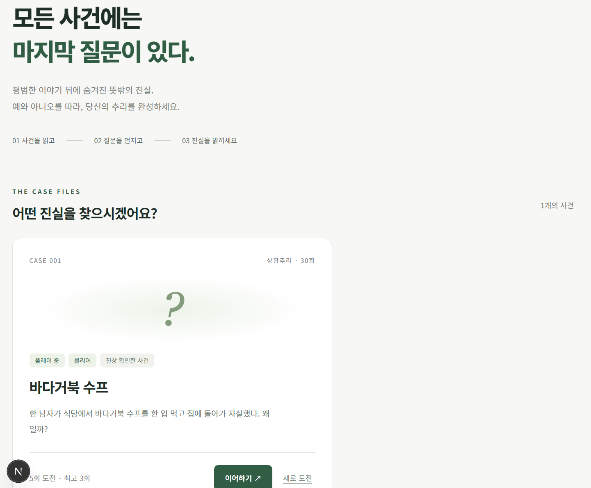
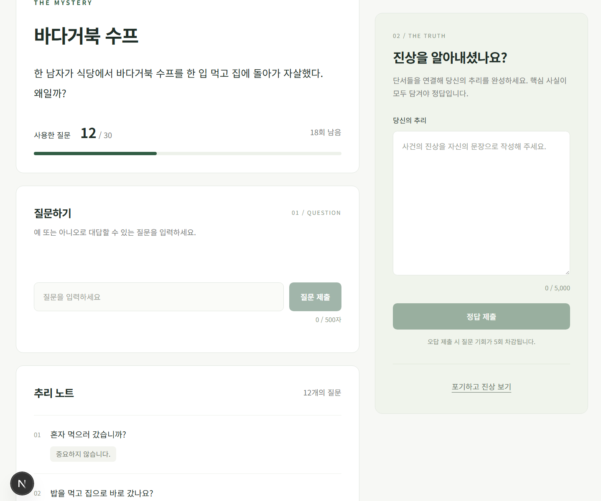
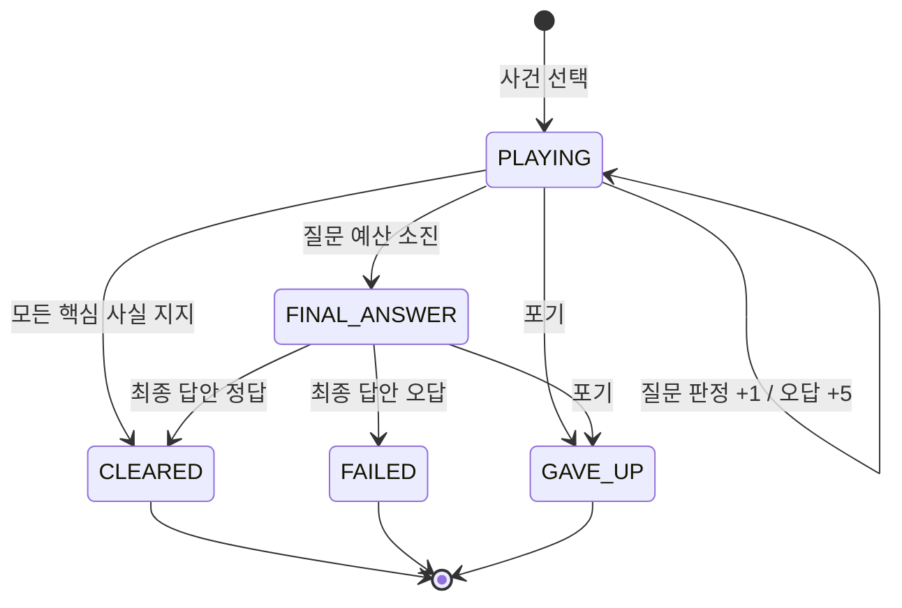

# End of Question · 질문의 끝

예스노탐정(https://yesnodetective.com/ko)을 보고 GPT API 기반 한국어 상황추리 게임 MVP입니다. Next.js는 공개 사건과 게임 화면을 담당하고, NestJS가 PostgreSQL의 진상과 질문 이력을 이용해 OpenAI에 판정을 요청합니다. 로그인 없이 브라우저 쿠키로 기록을 유지합니다.

## 화면 결과





## 빠른 시작

Node.js 22 이상(개발 검증: Node 24), Docker Desktop의 Linux 컨테이너 엔진이 필요합니다. pnpm이 없다면 `npm install -g pnpm@10.30.3`를 실행하거나, 아래 명령의 `pnpm`을 `npx --yes pnpm@10.30.3`으로 바꿔 실행하세요.

프로젝트 루트에서:

```powershell
pnpm install --frozen-lockfile
Copy-Item apps/api/.env.example apps/api/.env
Copy-Item apps/web/.env.example apps/web/.env.local
pnpm db:up
pnpm db:generate
pnpm db:migrate
pnpm db:seed
pnpm dev
```

이미 로컬 환경 파일이 있다면 Copy-Item은 생략하세요. macOS/Linux에서는 `cp`를 사용합니다. `apps/api/.env`의 `OPENAI_API_KEY`에 본인의 키를 넣어야 질문/답안 판정이 동작합니다. 키 없이도 사건 목록, 게임 시작, 기록 조회, 포기는 가능합니다. 키가 없을 때 AI 판정은 503을 반환하며 횟수를 차감하지 않습니다.

- 웹: http://localhost:3000
- API: http://localhost:3001
- PostgreSQL: localhost:5432 / end_of_question
- 개발 DB 사용자: eoq / 비밀번호: eoq_dev_password

`pnpm dev`는 공유 패키지를 먼저 빌드하고 웹/API를 함께 실행합니다. 공유 타입을 바꾼 경우 `pnpm --filter @eoq/shared build`를 다시 실행하세요. 개별 실행은 `pnpm --filter @eoq/api dev`, `pnpm --filter @eoq/web dev`입니다.

이 작업 공간에는 빈 키의 로컬 환경 파일과 예제 DB를 생성했습니다. 비밀 키는 저장하지 않았습니다.

## 구조와 Spring 개발자를 위한 안내

```text
apps/
  api/
    prisma/
      schema.prisma          관계형 모델 + 사건 story JSONB
      migrations/            초기 DDL, CHECK, partial unique index
      seed.ts                서버 전용 한국어 사건
    src/
      controller.ts          REST 경계, 입력 검증
      game.service.ts        게임 규칙, 트랜잭션, 공개 DTO
      prisma.service.ts      DB 연결 수명 관리
      bootstrap.ts           쿠키, CORS, Origin 검사, 오류 응답
      config.ts              환경 변수 검증
      ai/
        judge.ts             테스트 교체용 추상 클래스
        openai-judge.ts       공식 SDK, Structured Outputs, 서버 검증
        story.ts             내부 사건 데이터 검증
        prompts/             질문/정답 프롬프트를 별도로 버전 관리
    test/                    AI 계약 / 실제 PostgreSQL·HTTP 테스트
    scripts/eval-live.ts      선택 실행하는 실제 모델 평가
  web/
    app/                     Next.js App Router
    components/game.tsx      질문/답안/종료 화면
    lib/api.ts               credentials 포함 API 요청
packages/shared/             공개 타입, enum 값, 한국어 표시 문구
docker/compose.yml           개발용 PostgreSQL
tests/                       Playwright UI 테스트
scripts/                     빌드된 공개 자산 검사
```

| Spring에서 익숙한 개념 | 이 프로젝트 |
| --- | --- |
| @RestController | NestJS @Controller + @Get/@Post |
| @Service / 생성자 주입 | @Injectable + 명시적 @Inject |
| @Configuration / Bean | AppModule providers |
| @Transactional | Prisma $transaction 콜백 |
| JPA Entity / Repository | schema.prisma + PrismaClient |
| Bean Validation / DTO | 경계에서 Zod로 검증하고 공개 필드를 명시적으로 선택 |
| ControllerAdvice | 전역 예외 필터 |

서비스에 곧바로 Prisma를 주입했습니다. 단순 CRUD를 감싸는 Repository 계층은 추가하지 않았습니다. AI는 외부 서비스여서 `Judge`와 `StructuredClient` 경계만 분리했습니다. tsx 개발 실행에서도 주입이 동작하도록 @Inject를 명시합니다.

Next.js의 페이지는 목록/게임 UI를 구성하고 브라우저에서 NestJS를 호출합니다. SSR HTML, 공개 API, 공유 패키지에 내부 story를 포함하지 않습니다. 게임 화면은 URL의 gameId로 DB를 다시 조회하므로 새로고침 후에도 복원됩니다.

## 데이터 모델과 migration

- Case: 검색 가능한 title/question/maxQuestionCount와 유동적인 story JSONB.
- GameSession: 익명 소유자, 사건, 질문 예산, 상태, 최종 제출 여부.
- Question: 판정이 완료된 질문만 저장. (sessionId, requestId) unique.
- Submission: 의미 기반 채점 집계. 질문과 마찬가지로 requestId를 추가해 중복 패널티 방지.
- CaseProgress: (anonymousId, caseId) 복합 PK. 누적 cleared/failed/revealed, 시도 횟수, 최고 점수.
- 관계에는 FK, 세션/이력 조회에는 인덱스 적용.
- SQL CHECK로 질문 예산과 상태 일관성을 강제. partial unique index로 세션당 isFinal=true 제출을 최대 한 개로 제한.

`pnpm db:migrate`는 체크인된 migration을 적용하는 `prisma migrate deploy`입니다. 새 모델 변경을 개발할 때는 `pnpm --filter @eoq/api exec prisma migrate dev --name 변경이름`을 사용하세요. Prisma schema로 표현할 수 없는 CHECK/partial index는 생성 SQL을 검토해 유지해야 합니다.

Seed는 고정 UUID로 upsert하며 이미 존재하는 사건을 수정하지 않습니다. 진행 중 게임의 진상을 바꾸지 않도록 사건 수정본은 새 Case ID로 등록하는 방식을 선택했습니다. 세션은 예산만 복사하며 story snapshot은 두지 않으므로, DB에서 기존 Case.story를 직접 수정하면 해당 세션에도 반영됩니다.

개발 DB 종료는 `docker compose -f docker/compose.yml down`입니다. 기본적으로 named volume은 유지됩니다. Compose의 DB 포트는 127.0.0.1에만 공개합니다. 운영 DB에는 이 개발용 비밀번호를 사용하지 마세요.

## 게임 규칙과 상태 전이



기본 질문 예산은 30이고 Case별 변경 가능합니다. INVALID도 정상 판정이므로 1회를 사용합니다. 빈 입력, 잘못된 UUID/입력 형식, API timeout/429/5xx/거절/불완전 응답은 차감하지 않습니다.

PLAYING 중 오답은 `min(questionCount + 5, maxQuestionCount)`를 적용합니다. 이 결과로 한도에 도달해도 즉시 실패시키지 않고 FINAL_ANSWER로 전환합니다. FINAL_ANSWER에서는 질문을 막고 답안을 한 번만 허용하며 추가 패널티는 없습니다. AI가 실패한 시도는 최종 제출로 소비되지 않습니다.

정답 여부는 requiredFacts 전체가 SUPPORTED인지로 결정합니다. CONTRADICTED와 NOT_MENTIONED 모두 빠진 사실로 셉니다. 클라이언트에는 개수만 제공하고 코드/설명/사실별 판정은 전달하지 않습니다.

CLEARED/FAILED/GAVE_UP에서만 truth를 추가합니다. 종료 후 새로운 질문/답안은 409입니다. 동일 requestId의 이미 처리된 요청을 재전송한 경우에는 종료 후에도 현재 게임을 반환하지만 새 판정이나 차감은 하지 않습니다. 다시 도전하면 새로운 세션이며 과거의 진상 확인 기록은 유지됩니다.

최고 점수는 클리어한 세션의 questionCount 최솟값으로, 오답 패널티를 포함합니다. 한 사건에 여러 진행 중 시도를 허용하며 목록의 이어하기는 가장 최근 진행 중 세션을 가리킵니다. cleared/failed/revealed는 누적이므로 동시에 참일 수 있습니다.

## 동시성 및 idempotency

모든 세션 변경은 소유자 조건을 포함한 PostgreSQL `SELECT ... FOR UPDATE`로 동일한 세션 행을 잠급니다. 질문, 답안, 포기가 같은 잠금을 사용합니다.

1. 잠금 후 소유자/기존 requestId/상태 검사.
2. DB의 전체 질문 이력을 이용해 AI 판정.
3. 조건부 원자 UPDATE로 예산 변경.
4. 질문 또는 답안 기록과 진행 기록을 같은 트랜잭션에서 저장.
5. 커밋 후 공개 DTO 반환.

같은 requestId와 같은 입력이면 기존 처리 결과가 반영된 현재 게임을 돌려줍니다. 같은 ID에 다른 내용을 보내면 409입니다. requestId의 범위는 세션별·엔드포인트별입니다. 요청 실패 시 같은 ID로 재시도하세요. UI는 응답을 받기 전까지 ID를 유지하고 sessionStorage에 보관해 같은 탭 새로고침 재시도에도 재사용합니다.

MVP에서는 AI 호출 중에도 DB 트랜잭션/행 잠금을 유지합니다. 이 방식은 최신 질문 문맥과 최종 답안 1회 규칙을 간단하게 보장하지만, 느린 AI 요청이 DB 연결을 점유합니다. AI timeout은 25초, SDK 자동 재시도는 0회, 트랜잭션 timeout은 40초입니다. 같은 게임의 잠금 대기는 2초 뒤 재시도 가능한 503으로 종료합니다. 트래픽이 커지면 예약/완료 상태를 별도로 두는 구조를 고려할 수 있습니다.

DB 커밋 이후 응답이 유실되어도 같은 ID 재전송은 재차감하지 않습니다. 프로세스가 AI 호출 후 커밋 전에 죽으면 DB는 롤백되지만 OpenAI 비용까지 취소할 수는 없습니다. 이후 재시도로 AI 비용이 다시 발생할 수 있습니다.

## OpenAI 설정과 프롬프트

공식 Node SDK의 Responses API + `responses.parse` + `zodTextFormat`을 사용합니다. [OpenAI Structured Outputs 문서](https://developers.openai.com/api/docs/guides/structured-outputs)에 따라 JSON Schema로 출력 형식을 제한하고 서버에서 다시 검증합니다.

- 모델: `OPENAI_MODEL` 환경 변수. 예제 기본값은 `gpt-5.6-luna`이며 해당 계정에서 사용 가능한 Structured Outputs 지원 모델로 변경 가능합니다.
- 질문: TRUE/FALSE/UNKNOWN/MIXED/INVALID 외 응답을 받지 않습니다.
- 답안: requiredFacts의 code와 SUPPORTED/CONTRADICTED/NOT_MENTIONED만 허용. 중복/누락/알 수 없는 code를 거부합니다.
- 고정 규칙 → 진상 → facts → (답안 채점이면 requiredFacts) 순서를 앞쪽 developer 메시지에 둡니다.
- 전체 과거 Q&A → 현재 질문은 마지막 user 메시지의 JSON 데이터입니다.
- 사용자 텍스트는 developer/system 메시지로 승격하지 않습니다.
- 자유 설명이나 upstream SDK 오류를 프론트엔드로 전달하지 않습니다.
- `store: false`, previous_response_id/conversation 상태 저장을 사용하지 않습니다.
- Prompt Caching의 유무와 상관없이 매번 전체 문맥을 전송합니다.

출력 형식 제한은 정답/프롬프트 원문이 모델 출력에서 공개되는 경로를 막지만, 의미 판정 자체가 항상 정확하다는 보장은 아닙니다. 프롬프트 변경 시 선택적 실모델 평가를 실행하세요.

## REST API

모든 요청은 익명 쿠키 기반입니다. POST는 application/json입니다. anonymousId를 body에 넣으면 검증에서 거절합니다.

| API | 요청 body | 응답 |
| --- | --- | --- |
| GET /cases | 없음 | 공개 사건 + 누적 진행 기록 + activeGameId |
| GET /cases/:caseId | 없음 | 공개 사건 1개 |
| POST /games | { caseId } | 공개 게임 |
| GET /games/:gameId | 없음 | 공개 게임 + 질문/답안 이력 |
| POST /games/:gameId/questions | { requestId, question } | 갱신된 공개 게임 |
| POST /games/:gameId/submissions | { requestId, answer } | 갱신된 공개 게임, missingCount 포함 |
| POST /games/:gameId/give-up | {} | 종료 게임 + truth |

requestId/caseId/gameId는 UUID입니다. 질문은 공백 제거 후 1~500자, 답안은 1~5000자입니다. 다른 소유자의 세션은 존재 여부를 공개하지 않고 404를 반환합니다.

공개 게임 응답은 `packages/shared/src/index.ts`의 PublicGame을 참고하세요. 서버 내부 Prisma 객체를 그대로 serialize하지 않고 허용 필드만 선택합니다. 모든 API 응답은 Cache-Control: no-store입니다.

## 환경 변수와 배포

API 환경 파일은 apps/api/.env, 웹은 apps/web/.env.local입니다. production 예제는 각 앱의 .env.production.example에 있습니다. 환경 파일은 Git ignore 대상이며 example만 커밋합니다.

| API 변수 | 역할 |
| --- | --- |
| NODE_ENV | development / production / test |
| PORT | 기본 3001 |
| DATABASE_URL | PostgreSQL 연결 문자열 |
| OPENAI_API_KEY | 서버에서만 사용하는 비밀 키 |
| OPENAI_MODEL | Structured Outputs 지원 모델 |
| FRONTEND_URL | 허용할 웹 origin 하나 |
| COOKIE_DOMAIN | 기본 빈 값: API host-only cookie |
| COOKIE_SECURE | 개발 false 가능. production은 설정과 무관하게 true 강제 |
| LOG_LEVEL | error / warn / log / debug / verbose |

| Web 변수 | 역할 |
| --- | --- |
| NEXT_PUBLIC_API_URL | 브라우저가 접근할 API origin |
| NEXT_PUBLIC_APP_ENV | 배포 환경 구분용 공개 값 |

`NEXT_PUBLIC_*`는 빌드 시 브라우저 코드에 들어갑니다. OpenAI 키를 넣지 마세요. API URL을 바꾸면 웹을 다시 빌드해야 합니다.

개발은 localhost:3000 → localhost:3001이며 credentials: include를 사용합니다. 운영 예시의 https://endofquestion.com → https://api.endofquestion.com은 서로 다른 origin이지만 같은 site여서 SameSite=Lax 쿠키를 사용할 수 있습니다. API host-only cookie여도 브라우저의 API 요청에 정상 전송되므로 COOKIE_DOMAIN을 기본으로 비워 두었습니다. 필요하면 .endofquestion.com으로 지정할 수 있습니다.

최초 유효한 쿠키가 없는 접근에 UUID를 생성하며 HttpOnly, SameSite=Lax, Path=/, 1년 Max-Age를 설정합니다. production에서는 Secure=true이고 HTTPS FRONTEND_URL과 API 키가 필수입니다. 개발 프론트와 API 호스트에 localhost와 127.0.0.1을 혼용하지 마세요. 서로 다른 site의 임시 배포 도메인은 이 Lax 쿠키 구성의 지원 대상이 아닙니다.

CORS는 정확한 FRONTEND_URL origin과 credentials를 허용합니다. CORS만으로 쓰기를 보호하지 않고 POST의 Origin과 JSON Content-Type도 검사합니다. 쿠키는 서명하지 않은 익명 UUID이며 계정 수준 인증이 아닙니다. 삭제/다른 브라우저 사용 시 새 사용자입니다.

운영 예시:
```text
pnpm install --frozen-lockfile
pnpm db:generate
pnpm db:migrate
pnpm build
pnpm --filter @eoq/api start
pnpm --filter @eoq/web start
```

두 start 명령은 별도 프로세스/터미널에서 실행합니다. 운영 환경 변수와 HTTPS reverse proxy는 배포 환경에서 설정해야 합니다. Docker Compose는 개발 DB용입니다. Redis/Kafka/WebSocket/마이크로서비스는 사용하지 않았습니다.

## 검증

```powershell
pnpm typecheck
pnpm test
pnpm test:integration
pnpm build
pnpm exec playwright install chromium
pnpm test:ui
```

- 단위 테스트: 다섯 verdict, 인젝션의 user 데이터 격리, 잘못된 모델 출력, 사실별 집계/중복/누락/부정 판정 전달.
- PostgreSQL 통합 테스트: 질문 증가/INVALID/실패 미차감, 동시 중복 요청, 마지막 질문 경합, +5와 상한, 최종 답안 성공/실패/재시도/동시 제출, 포기, 누적 기록, 소유자, DB 제약과 HTTP 경계.
- 통합 테스트는 무작위 Case ID를 만들고 그 사건의 테스트 행만 정리합니다. migration이 적용된 로컬 DB에서 실행하세요. OpenAI는 mock입니다.
- UI 테스트는 운영 빌드와 seed가 필요하며 3000/3001 포트가 비어 있어야 합니다. 테스트가 서버를 자동 시작/종료하고 API 키를 비워 실제 모델을 호출하지 않습니다. 실제 API로 쿠키/새로고침/실패 미차감/포기/모바일 화면을 확인하며, 최종 성공/실패 UI는 명시적인 API 응답 fixture로 확인합니다. 브라우저 테스트는 새 익명 사용자의 시도를 seed 사건에 남깁니다.
- build 끝에 client JavaScript를 검사해 서버 전용 fact code, 프롬프트, 사건 비밀 표식의 유출을 탐지합니다. 공개 DTO 누출도 별도로 통합 테스트합니다.
- 스크린샷은 test-results에 저장됩니다.

실제 모델의 한국어 의미 판정은 mock 테스트로 검증할 수 없습니다. 키를 설정한 뒤 원할 때 `pnpm eval:live`를 실행하세요. 질문 6개(5개 판정+인젝션)와 바꿔 쓴 정답/부정 답안 2개를 실제 호출하므로 API 비용이 발생합니다. 키가 없는 현재 작업에서는 이 평가는 실행하지 않았습니다.

## 현재 MVP의 경계

### 질문 판정 효과와 음성

질문 입력은 최대 500자이며 현재 글자 수를 표시합니다. 판정은 입력란 위에 나타난 뒤 최소 3.2초 동안 유지되고 사라집니다. 음성이 더 길면 재생 길이에 맞춰 표시 시간을 늘립니다. 과거 판정은 추리 노트에 남습니다.

음성은 `apps/web/public/audio`에서 제공합니다. TRUE/FALSE/MIXED/UNKNOWN은 각각 `yes_voice.mp3`, `no_voice.mp3`, `maybe_voice.mp3`, `notimport_voice.mp3`를 사용합니다. 정답/오답 제출에는 `correct_voice.mp3`/`incorrect_voice.mp3`를 사용합니다. INVALID는 문구만 표시합니다. 서버 판정 응답에 맞춰 재생하며, 새로고침이나 API 오류에는 재생하지 않습니다. 브라우저가 음성을 차단해도 판정 문구는 표시됩니다.

웹 개발 서버가 실행 중일 때 `node scripts/check-feedback.cjs http://localhost:3000`으로 입력 제한, 판정 효과, 음성 재생을 검증할 수 있습니다. 게임 API는 테스트 응답으로 대체하므로 DB 변경이나 OpenAI 호출은 없습니다.

세션의 질문 한도와 입력 길이를 제한하지만 브라우저 쿠키를 지우거나 새 세션을 반복 생성하는 비용 남용까지 막지는 않습니다. 공개 서비스 확대 시 별도의 이용량 정책을 추가할 수 있습니다. seed에는 자살과 식인 소재의 전형적인 바다거북 수프 이야기가 포함되어 있습니다.

필요 이상으로 추상화하지 않았으며 로그인, 사건 관리 UI, 자동 문제 생성, 모델 응답 explanation 공개는 포함하지 않습니다.
